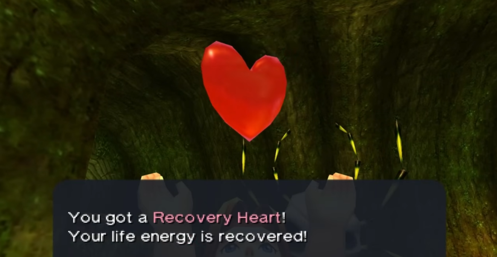
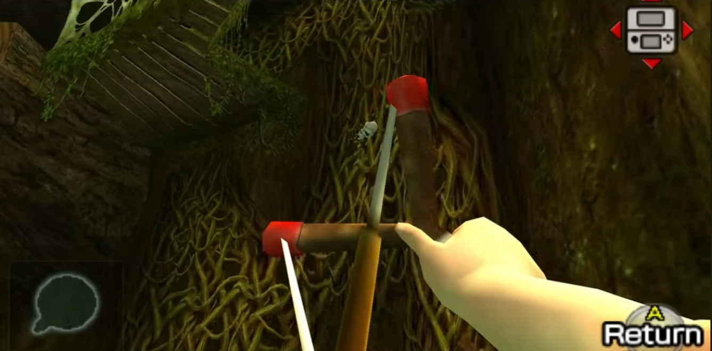
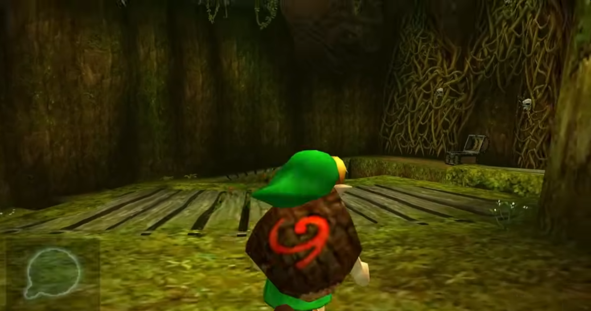

# Especificação da Implementação

<!--
> [!CAUTION]
> - Você <ins>**não pode utilizar ferramentas de IA para escrever esta
>   especificação**</ins>
-->

## Integrantes da dupla

- **Aluno 1 - Nome**: Eduardo Magnus Lazuta
- **Aluno 1 - Cartão UFRGS**: 325091

- **Aluno 2 - Nome**: Vitor Alexandre Arguilar
- **Aluno 2 - Cartão UFRGS**: 344617

## Detalhes do que será implementado

- **Título do trabalho**: Réplica do The Legend of Zelda Ocarina of Time (versão do nintendo 3DS)
- **Parágrafo curto descrevendo o que será implementado**: Será implementado a fase conhecida como "inside the Deku Three", onde o personagem Link deve lutar contra os inimigos, resolver quebra-cabeças e alcançar o nível mais baixo da Árvore Deku, onde enfrentará o boss final da fase.

## Especificação visual

### Vídeo - Link

<!--
> [!IMPORTANT]
> - Coloque aqui um link para um vídeo que mostre a aplicação gráfica
>   de referência que você vai implementar. **Sua implementação deverá
>   ser o mais parecido possível com o que é mostrado no vídeo (mais
>   detalhes abaixo).**
> - **Você não pode escolher como referência: (1) algum trabalho realizado
>   por outros alunos desta disciplina, em semestres anteriores. (2) Minecraft.**
> - Por exemplo, você pode colocar um vídeo de um jogo que você gosta,
>   e seu trabalho final será uma re-implementação do jogo.
> - O vídeo pode ser um link para YouTube, Google Drive, ou arquivo mp4 dentro
>   do próprio repositório. Mas, garanta que qualquer um tenha
>   permissão de acesso ao vídeo através deste link.
-->

[The Legend of Zelda Ocarina of Time - (10:10 - 21:30) ](https://www.youtube.com/watch?v=4bHUl92VNFg)

### Vídeo - Timestamp

<!--
> [!IMPORTANT]
> - Coloque aqui um **intervalo de ~30 segundos** do vídeo acima, que
>   será a base de comparação para avaliar se o seu trabalho final
>   conseguiu ou não reproduzir a referência.
-->
- **Timestamp inicial**: `12:50`
- **Timestamp final**: `13:40`

### Imagens

## Especificação textual

Para cada um dos requisitos abaixo (detalhados no [Enunciado do Trabalho final - Moodle](https://moodle.ufrgs.br/mod/assign/view.php?id=6018620)), escreva um parágrafo **curto** explicando como este requisito será atendido, apontando itens específicos do vídeo/imagens que você incluiu acima que atendem estes requisitos.

### Malhas poligonais complexas
Como visto nas imagens e no vídeo, tanto o cenário, personagem principal e os inimigos possuem uma malha poligonais complexas.  

### Transformações geométricas controladas pelo usuário
Algumas das transformações controladas pelo usuário é movimentação do personagem (translação) e a rotação e movimento da espada durante ataques.

### Diferentes tipos de câmeras
Como podemos ver na imagem, o jogo possui duas câmeras: uma câmera que "persegue" o personagem link (visão em terceira pessoa - câmera look at) e uma câmera que representa a visão em primeira pessoa (câmera livre) quando o personagem link mira com o estilingue para acertar nas aranhas.

### Instâncias de objetos
Esse requisito é garantido, pois temos objetos (por exemplo, aranhas, tochas) que possuem várias instâncias no mesmo local.

### Testes de intersecção
Alguns testes de intersecção previstos é quando o personagem link faz o "paring"/reflete um objeto que um inimigo lança na sua direção. Outros testes de intersecção é quando o personagem link chega muito perto de um inimigo (no caso sofre dano) ou quando colido com uma parede ou um "alavanca" no cenário. 

### Modelos de Iluminação em todos os objetos
O modelo de iluminação do jogo parece ser feito usando iluminação por vértices, mas se considerou usar um dos modelos de iluminação mais clássicos vistos em aula. A iluminação presente é visível nas texturas do cenário (principalmente chão e paredes), mas é imperfeita, principalmente ao redor de fontes de luz como tochas. 

### Mapeamento de texturas em todos os objetos
Como visto no vídeo, os objetos respeitam a restrição, possuindo cores texturizadas individuais, como as paredes, pilares, e inimigos.

### Movimentação com curva Bézier cúbica
<mark>`<preencher>`</mark>

### Animações baseadas no tempo ($\Delta t$)
A fada que fica constantemente voando ao redor do personagem possui uma animação baseada em tempo, rotacionando ao redor do personagem principal mesmo quando o mesmo permanece parado. Outro exemplo é a rotação dos itens encontrados em baús.

## Limitações esperadas

> [!IMPORTANT]
> - Coloque aqui uma lista de detalhes visuais ou de interação que
>   aparecem no vídeo e/ou imagens acima, mas que você **não pretende
>   implementar** ou que você **irá implementar parcialmente**.
> - Para cada item, **explique por que** não será implementado ou por
>   que será implementado parcialmente.

<mark>`<preencher>`</mark>
